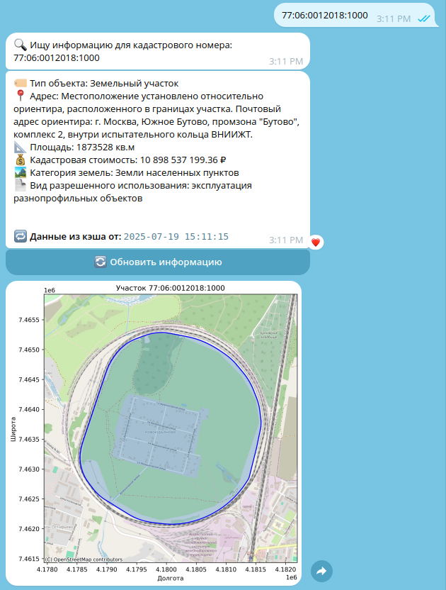

# RealtyBot

**RealtyBot** — это Telegram-бот для получения информации об объектах недвижимости по кадастровому номеру с отображением на карте.

## Возможности

- Получение информации об объекте недвижимости по кадастровому номеру (адрес, площадь, стоимость, категория земель и др.).
- Кэширование результатов для ускорения повторных запросов.
- Отображение границ участка на карте.
- Обновление информации по запросу пользователя.
- Удобная интеграция и деплой через Docker и GitHub Actions.

## Ручной старт

### 1. Клонирование репозитория

```sh
git clone https://github.com/vektorver/realty.git
cd realty
```

### 2. Получите API_TOKEN через BotFather в Telegram


### 3. Запуск через Docker

```sh
export API_TOKEN=ваш_токен_бота
docker compose up --build
```


## Структура проекта

```
docker-compose.yml
server_start.sh
.github/workflows/cd.yml
bot/
  bot.py
  Dockerfile
  requirements.txt
  handlers/
    cadastral.py
    commands.py
    __init__.py
  utils/
    cache.py
    formatter.py
    plotter.py
    __init__.py
```

## Как пользоваться

1. Запустите бота.
2. В Telegram отправьте кадастровый номер (например, `77:01:0004012:2042`).
3. Получите подробную информацию и карту участка.
4. Для обновления информации используйте кнопку "Обновить".



## Автоматический деплой

Настроен CI/CD через GitHub Actions для автоматического деплоя на VPS при пуше в ветку `main`.


**Автор:** [vektorver](https://github.com/vektorver)